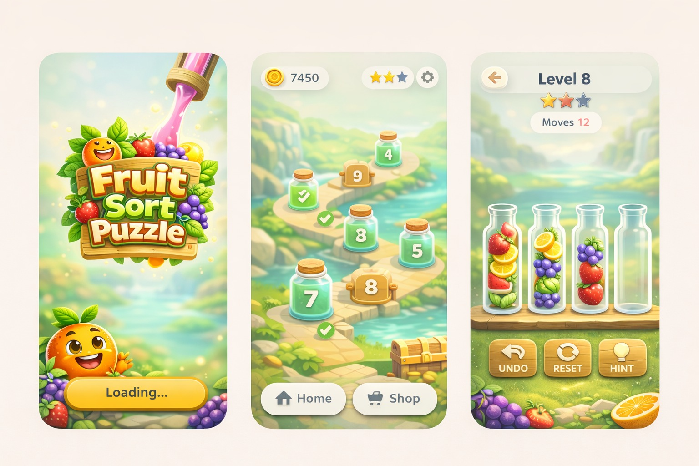

# 🍓 FruitFlow

A cross-platform fruit sorting puzzle game built with Flutter using a clean layered architecture and BLoC state management.

FruitFlow challenges players to sort fruit slabs into bottles following stacking rules across 100 progressively difficult levels — fully offline.

---

## 📱 UI Preview



---

## 🚀 Features

### 🎮 Core Gameplay
- 100 progressively challenging levels
- Water-sort-style fruit stacking mechanics
- Move validation with stacking rules
- Undo functionality
- Level reset option
- Win condition detection
- Loss detection when no moves remain

### 🗺 Progression System
- Interactive roadmap level selection
- Sequential level unlocking
- Level replay support
- Continue from last unlocked level

### 💾 Offline Persistence
- Local progress tracking
- Game state storage
- Settings management
- Fully offline support

### 🎨 UI & Experience
- Animated splash screen
- Onboarding flow for first-time users
- Responsive UI (Android, iOS, Web, Desktop)
- Custom fruit slab & bottle assets

---

## 🏗 Architecture

FruitFlow follows a **Layered Architecture per Feature**:

- **Presentation Layer**
- **Business Logic Layer**
- **Data Access Layer**

Each feature is structured as:
```
features/
 └── feature_name/
      ├── data/
      ├── domain/
      └── presentation/
```

### 🧠 State Management
- **BLoC** (Business Logic Component)

### 💾 Local Storage
- **Hive** (NoSQL local storage)

---

## 🛠 Tech Stack

| Area              | Technology                                      |
|-------------------|-------------------------------------------------|
| Framework         | Flutter                                         |
| Language          | Dart                                            |
| State Management  | BLoC                                            |
| Database          | Hive                                            |
| Utilities         | Equatable, Path Provider, Google Fonts          |
| Platforms         | Android, iOS, Web, Desktop                      |

---

## 📂 Project Structure
```
lib/
│── main.dart
│
├── core/
│   └── utils/
│       ├── constants/
│       ├── game_config/
│       ├── responsive/
│       ├── themes/
│       └── widgets/
│
└── features/
    ├── game_map/
    ├── game_play/
    └── initial/
```

---

## 🎯 Functional Highlights

- Dynamic level generation
- Move validation engine
- Stack-based puzzle logic
- Undo & reset state tracking
- Win/Loss detection system
- Persistent progression storage

---

## 🧪 Development Methodology

- **Agile** (Scrum-based)
- 1-week sprints
- 2-month project duration
- Feature-driven development

---

## 📌 Future Enhancements

- Cloud save support
- Additional level packs
- Advanced difficulty modes
- Accessibility improvements

---

## 🧩 Getting Started
```bash
git clone https://github.com/maitry4/fruitflow.git
cd fruitflow
flutter pub get
flutter run
```

---

## 📄 License

This project is developed for academic and learning purposes.